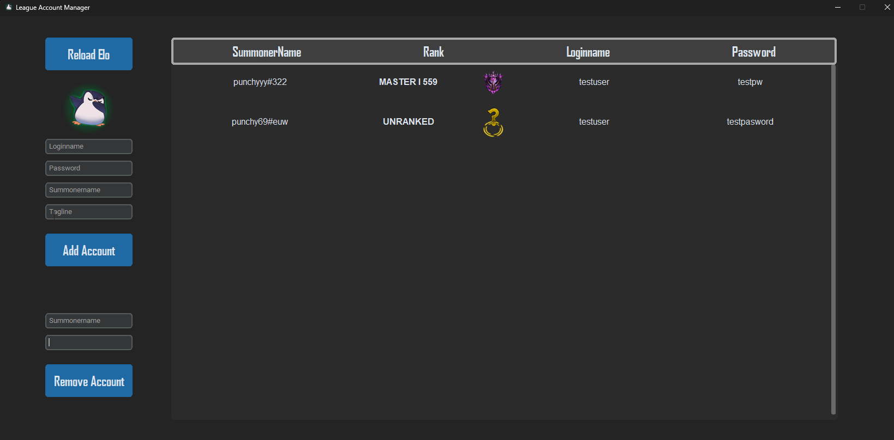

# LolAccountManager

Small tool designed to keep track of your userdata if you have a lot of league of legends accounts. Simply put in your logindata and the tool will automatically track your elo and namechanges for all accounts.

The use case behind this tool is just availability and overview when trying to log into league. Sometimes you dont remember which account has which logins or which account is eligable to play duoq. Easy to check, copy and login through the saved data.

First project and first gui in python, dont judge too much

## Setup
Create a new file with your `api_key` from riot dev if you are trying to add/change stuff. Make sure to import it into `LeagueAccount.py` If done, just execute `AccountManager.py` and it should work

## Data
All login data is saved in a folder in appdata, gets modified and resaved all at the same location. Nothing gets saved online or sent anywhere, just saved locally in a json file

## Features & Bugs
If you find any bugs or other issues please feel free to write me on twitter or git, same goes for feature ideas or contribution.
